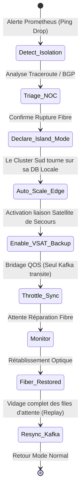

# VOLUME 5 : Playbooks Opérationnels de Crise (Operational Playbooks)
## Infrastructure Souveraine de Continuité de l'État — SNISID

Les équipes d'ingénierie de l'État (SOC / NOC / SRE) utilisent ces procédures standardisées (SOP) pour garantir la continuité des opérations gouvernementales en cas de désastre majeur.

---

## 📖 PLAYBOOK 1 : RUPTURE DE FIBRE OPTIQUE MAJEURE (ISOLATION RÉGIONALE)

**Déclencheur :** Perte de connectivité BGP avec le cluster Sud (Les Cayes) depuis plus de 15 minutes.
**Impact :** Le département du Sud est informatiquement isolé de la capitale.

### Workflow d'Intervention (NOC)



---

## 📖 PLAYBOOK 2 : CYBERATTAQUE NATIONALE (RANSOMWARE D'ÉTAT)

**Déclencheur :** Le SIEM (Wazuh / Splunk) détecte un comportement de chiffrement massif sur les pods Kubernetes ou une exfiltration de données anormale.

### Procédure de Sauvegarde de l'État (CISO Command)
1.  **DEFCON 2 (Containment) :** L'Ingénieur en Chef ordonne la déconnexion physique de l'API Gateway Nationale vers l'international. Les frontières logiques sont fermées.
2.  **Zero Trust Lockdown :** Révocation immédiate des tokens JWT actifs. Obligation de ré-authentification FIDO2 pour tout agent de l'État.
3.  **Bascule Bunker (DEFCON 1) :** Si la base de données principale est corrompue (malgré les défenses), l'ordre est donné de couper l'alimentation des datacenters primaires.
4.  **Restauration WORM :** Boot des serveurs de secours depuis le stockage S3 MinIO Object Lock. Le cluster est reconstruit *from scratch* via GitOps (ArgoCD) en 45 minutes, en réimportant les données saines de la veille.

---

## 📖 PLAYBOOK 3 : TREMBLEMENT DE TERRE MAJEUR (DÉTRUCTION DE PORT-AU-PRINCE)

**Déclencheur :** Alerte Sismique Majeure + Perte Totale de télémétrie du Datacenter 1 (DC1).

### Workflow de Survie (Automatisé)
Ce playbook est majoritairement automatisé car les équipes humaines à Port-au-Prince pourraient être hors d'état d'agir.

```mermaid
graph TD
    A[Perte Totale Télémétrie DC1] --> B{Timer 120 Secondes}
    B -->|Pas de reprise| C[Global Load Balancer: Failover]
    C --> D[Routage 100% Trafic vers Cap-Haïtien (DC2)]
    D --> E[Kafka DC2: Promote to Leader]
    E --> F[K8s Cluster Auto-Scaler: +300% Pods (AWS Cloud Bursting si activé)]
    F --> G[Désactivation des workflows non critiques]
    G --> H[Priorisation Enrôlement Catastrophe / Identification Victimes]
```

### Modes de Dégradation Gracieuse (Graceful Degradation)
Pendant la crise, le système désactive les fonctions lourdes pour sauver la bande passante et le CPU :
*   *Désactivé :* Rapports analytiques, batch de synchronisation inter-agences non vitale.
*   *Maintenu :* Authentification eID, identification biométrique des corps (ABIS limité), soins médicaux d'urgence.

---

## 🔧 OUTILLAGE DE SYNCHRONISATION (TROUBLESHOOTING)

Si une valise d'enrôlement mobile (MEK) n'arrive pas à se synchroniser après une mission de 3 jours :
1.  **Vérification Physique :** L'agent branche la valise au réseau filaire du commissariat local.
2.  **Force Push :** L'agent tape la commande CLI souveraine `snisid-sync --force --tls-verify`.
3.  **Extraction Manuel (Sneakernet) :** Si échec réseau, l'agent utilise le script `snisid-export-usb` pour générer un blob AES-256 GCM transférable physiquement vers le centre régional.
