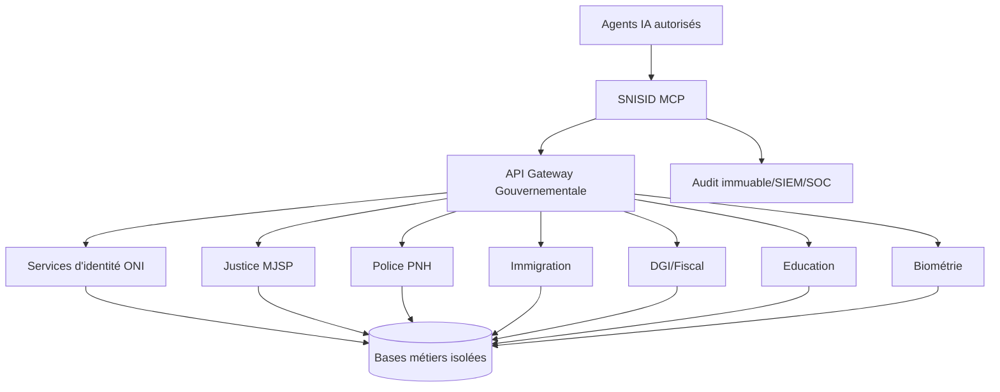

# Phase 0 — Fondation stratégique nationale

## Architecture nationale

## Stratégie IA souveraine

1. Les agents IA ne reçoivent que des résultats minimisés selon le rôle et le besoin d’en connaître.
2. Les tools refusent toute demande sans finalité légale (`purpose`) et corrélation (`correlationId`).
3. Les prompts système imposent le rejet des tentatives de prompt injection, d’exfiltration et de contournement RBAC.
4. Les décisions à impact légal restent assistées, traçables et validées par un agent humain habilité.

## Architecture MCP

- **STDIO** : intégration locale contrôlée avec Claude Desktop, Cursor, VSCode, Copilot-like clients.
- **Streamable HTTP** : intégration réseau derrière API Gateway/mTLS/WAF.
- **Tools** : uniquement façades sécurisées vers API gouvernementales.
- **Resources** : schémas nationaux, politiques, procédures.
- **Prompts** : cadres d’analyse gouvernementaux anti-injection.

## Zero Trust

- Authentification forte pour chaque requête.
- Autorisation par permission fine, rôle, domaine et classification.
- Vérification device, session, MFA, risque, rate limit.
- Audit obligatoire avant/après exécution.
- Deny-by-default.

## API Gateway

- mTLS entre Gateway et microservices.
- OAuth2/JWT introspection.
- Rate limiting par ministère, rôle et tool.
- WAF, contrôle IP, geo-policy, schema validation.
- Observabilité OpenTelemetry.

## IAM/RBAC

- Rôles gouvernementaux centralisés.
- Permissions granularisées par domaine (`identity:verify`, `justice:read`, etc.).
- Séparation des tâches : analyste, enquêteur, juge, auditeur, SOC.
- MFA obligatoire sur données sensibles.

## Audit et conformité

- Journalisation immuable en chaîne de hash.
- Rédaction des secrets et données biométriques.
- Export JSONL pour SIEM/SOC.
- Incident response avec niveaux de sévérité.
