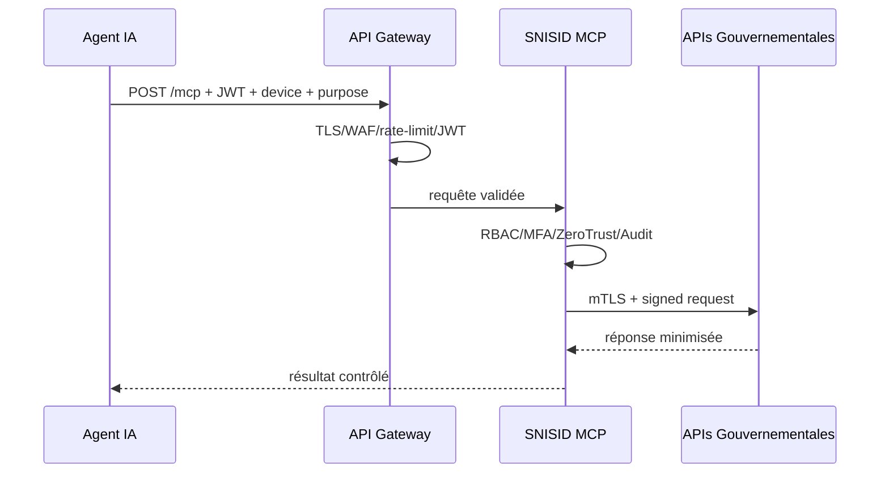

# API Gateway SNISID

La Gateway est le seul point d’entrée réseau pour le MCP HTTP et les microservices gouvernementaux.

## Politiques minimales

- TLS 1.3, mTLS interne.
- Validation JWT et API key rotation.
- WAF OWASP CRS.
- Rate limits par client, ministère, rôle, permission et risque.
- Rejet des payloads non conformes aux schemas Zod/OpenAPI.
- Propagation `x-correlation-id`, `x-purpose`, `x-device-id`.
- Journaux d’accès sans secrets.

