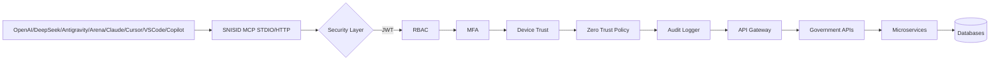

# Architecture finale SNISID MCP

## Isolation

- Les tools MCP sont des façades ; ils ne connaissent ni credentials DB ni schémas internes.
- Les microservices métiers détiennent la logique d’accès aux données.
- Les logs sont hachés en chaîne et rédigés.

## Flux sécurisé

1. Agent IA appelle un tool avec `auth` : JWT, device, purpose, correlationId, MFA si nécessaire.
2. Tool valide schema Zod.
3. AuthN/AuthZ/RBAC/MFA/Zero Trust.
4. Audit avant exécution.
5. Appel API Gateway avec headers corrélés.
6. Retour minimisé.
7. Audit de succès/échec.
