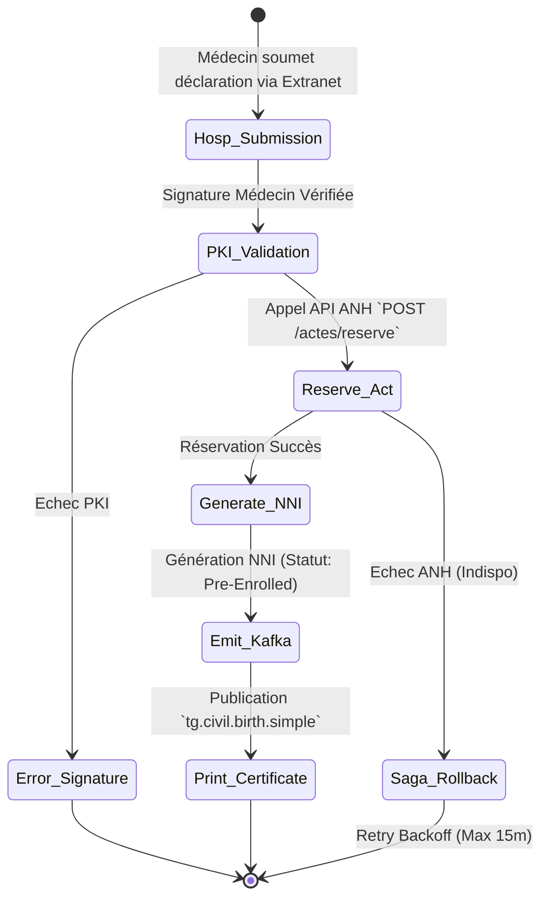
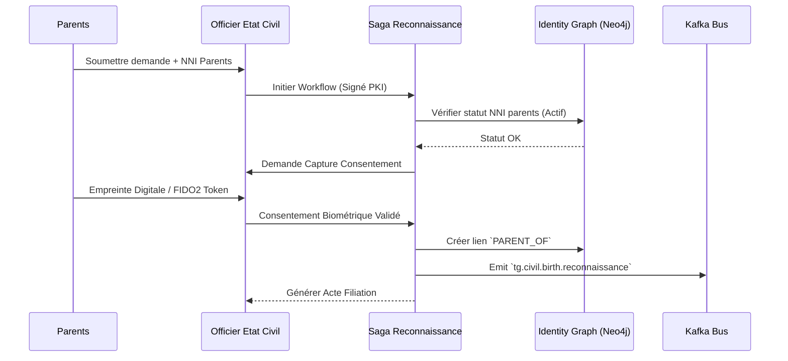
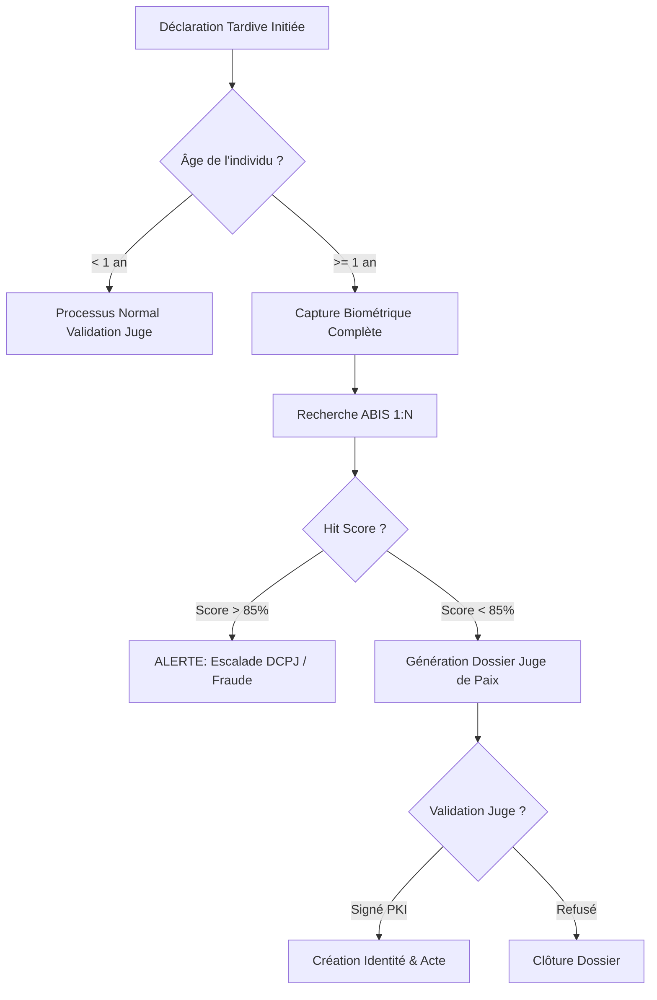
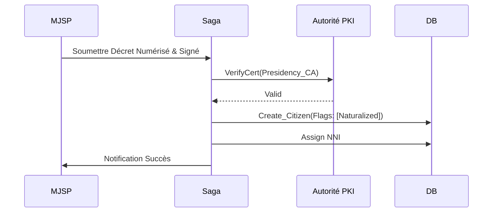
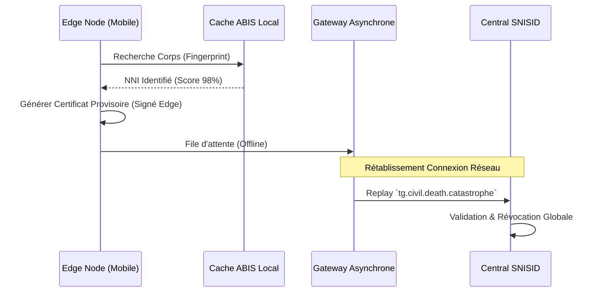
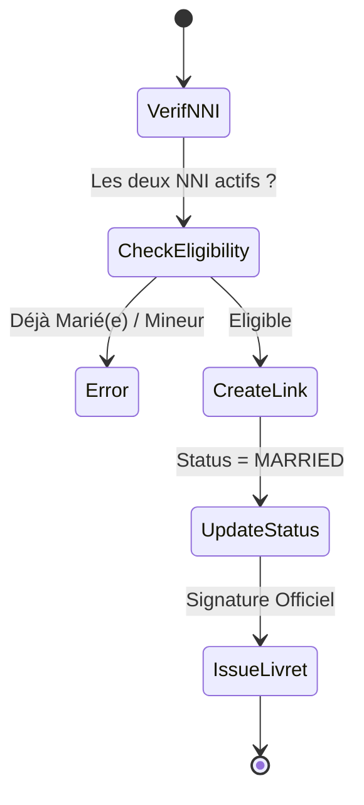
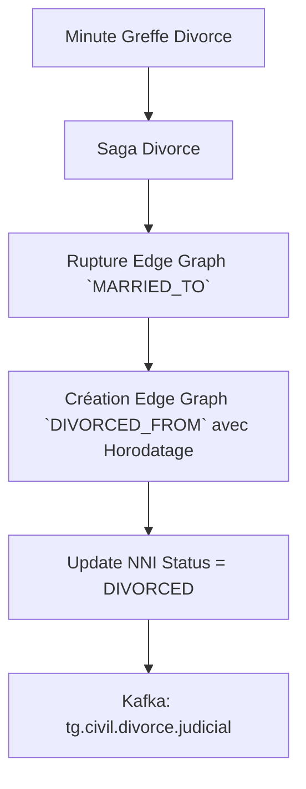
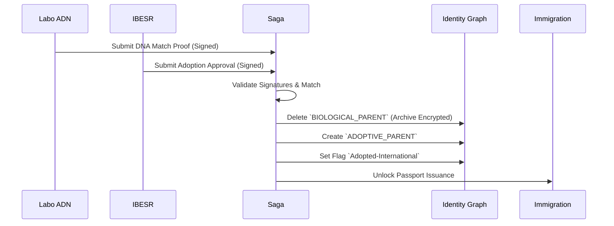

# VOLUME 1 : Workflows d'État Civil (Civil Registration)
## Usine Nationale des Workflows — SNISID

Ce document détaille les architectures d'orchestration (BPMN) des événements de la vie civile en Haïti. Chaque flux implémente la validation humaine stricte, les contrôles cryptographiques, et les transactions distribuées (Saga).

---

## 🤰 CHAPITRE 1 : USINE DES NAISSANCES (BIRTH)

### 1.1 Naissance Simple (En maternité)
*   **SLA:** Déclaration sous 72 heures. **SLO d'Exécution:** 15 minutes.
*   **Acteurs:** Hôpital (MSPP), Officier d'État Civil (ANH), Registre SNISID.
*   **Description:** Enregistrement direct à l'hôpital. Génération de l'acte et du NNI temporaire `Pre-Enrolled`.



### 1.2 Naissance par Reconnaissance (Filiation)
*   **SLA:** Traitement guichet 48h.
*   **Acteurs:** Parents, Officier d'État Civil.
*   **Description:** Liaison d'un enfant à ses parents biologiques post-naissance. Vérification biométrique FIDO2 des parents requise pour consentement.



### 1.3 Naissance par Déclaration Tardive
*   **SLA:** Enquête sous 10 jours ouvrés.
*   **Description:** Si l'âge > 1 an, enquête ABIS stricte obligatoire pour éviter la création d'identités fantômes.



### 1.4 Naissance par Décret (Naturalisation)
*   **Acteurs:** Présidence, MJSP, ONI.
*   **Description:** L'intégration de citoyens naturalisés sur décret présidentiel. Le certificat de la Présidence est audité.



### 1.5 Naissance par Jugement rendu des Minutes
*   **Description:** Reconstruction d'un registre détruit (fréquent en Haïti suite aux séismes).
*   **Processus:** Le greffier soumet le jugement numérisé dans le système WORM. Le statut de l'acte est flaggé `Reconstructed-Judicial`.

---

## ⚰️ CHAPITRE 2 : USINE DES DÉCÈS (DEATH)

### 2.1 Décès Standard
*   **SLA:** Révocation globale < 10 minutes.
*   **Description:** Suspend instantanément la carte électorale, fiscale et le passeport.

```mermaid
graph LR
    A[Certificat MSPP Signé] --> B[Saga Décès]
    B --> C[Identity Registry: Status = DECEASED]
    C --> D[AN-PKI: Revoke eID Certificate (OCSP)]
    D --> E[Kafka Emit: tg.civil.death.standard]
    E --> F[DGI: Gel Fiscal]
    E --> G[CEP: Radiation Électorale]
    E --> H[Immigration: Annulation Passeport]
```

### 2.2 Décès Judiciaire
*   **Description:** Suite à une décision du tribunal. Même impact technique que le standard, mais nécessite la signature mTLS du Greffier.

### 2.3 Décès Catastrophe (Force Majeure)
*   **SLA:** Traitement Offline-First.
*   **Description:** Déclaration par la Protection Civile sur terminaux Edge. Synchronisation asynchrone Kafka via VSAT.



### 2.4 Disparition / Absence
*   **Description:** Le citoyen est absent. Statut = `Disappeared-Active-Suspended`. Gel des droits mais l'identité n'est pas "décédée".

---

## 💍 CHAPITRE 3 : USINE DES MARIAGES (MARRIAGE)

### 3.1 Mariage Civil
*   **Description:** Validation des conditions (célibat, non-consanguinité). Création du lien dans le graphe Neo4j.



### 3.2 Mariage Judiciaire (Concubinage homologué)
*   **Description:** Processus initié par le MJSP. Validation asynchrone par l'ANH avant écriture dans le registre d'état civil.

### 3.3 Mariage Religieux Reconnu
*   **Description:** Pasteur/Prêtre agréé. Saisie sur portail extranet, signature numérique requise.

---

## 💔 CHAPITRE 4 : USINE DES DIVORCES (DIVORCE)

### 4.1 Divorce Judiciaire
*   **SLA:** 48 heures post-jugement.
*   **Description:** Rupture du lien marital dans Neo4j. Conservation historique `Divorced-From`.



### 4.2 Divorce Administratif
*   **Description:** Transcription de jugement étranger. Nécessite une adjudication si les données démographiques du pays d'origine diffèrent du registre SNISID.

---

## 👶 CHAPITRE 5 : USINE DES ADOPTIONS (ADOPTION)

### 5.1 Adoption Nationale
*   **Description:** Rupture de l'ancienne filiation et création d'une nouvelle. Historique restreint sous sceau judiciaire.

### 5.2 Adoption Internationale
*   **SLA:** Strict, vérification ADN.
*   **Description:** Empêche le trafic humain. Requiert certificat laboratoire et aval IBESR + MJSP.


