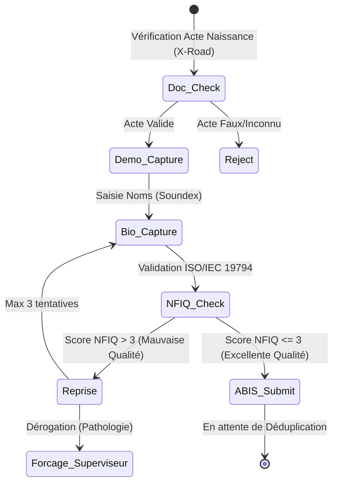
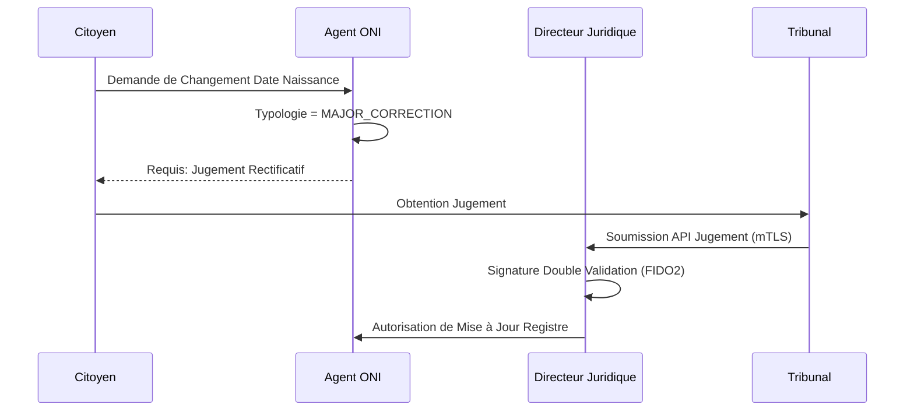
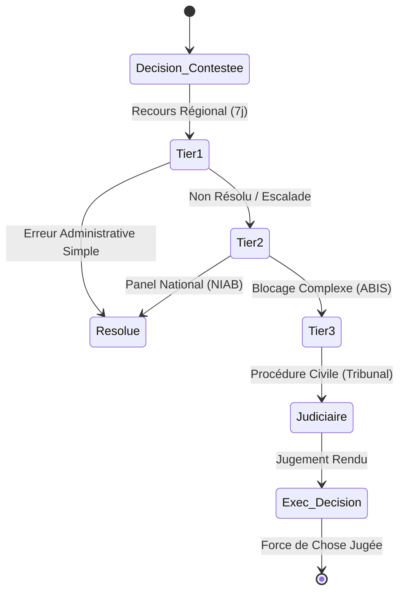
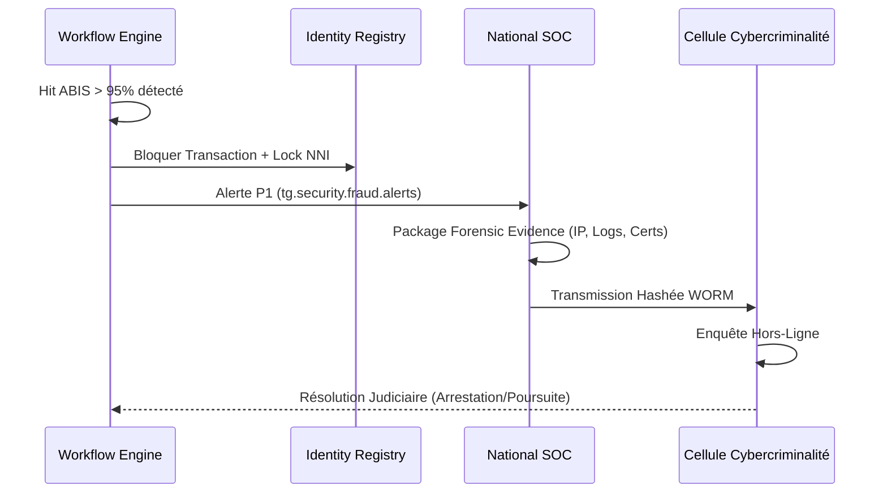

# VOLUME 2 : Workflows d'Identité et Processus de Sécurité (Identity & Security)
## Usine Nationale des Workflows — SNISID

Ce volume détaille l'orchestration des flux relatifs au cycle de vie de l'Identité Numérique Nationale, depuis l'enrôlement biométrique jusqu'aux processus d'adjudication légale et d'enquêtes cybercriminelles (DCPJ).

---

## 👤 CHAPITRE 1 : ENRÔLEMENT ET QUALITÉ BIOMÉTRIQUE (ENROLLMENT)

### 1.1 Enrôlement Initial (Guichet ONI)
*   **SLA:** Traitement guichet < 15 min.
*   **Description:** Capture démographique assistée par Soundex/Levenshtein (adaptation linguistique Créole/Français). Capture biométrique multicritère (Visage OACI, 10 Empreintes, Iris).



---

## 👁️ CHAPITRE 2 : DÉTECTION DE DOUBLONS (ABIS DEDUPLICATION)

L'ABIS (Automated Biometric Identification System) exécute une recherche 1:N complète sur le cluster GPU de l'État.

```mermaid
graph TD
    A[Template Biométrique Soumis] --> B[Recherche 1:N ABIS]
    B --> C{Score de Similarité}
    C -->|< 75% (No Hit)| D[Approbation Automatique]
    C -->|75% - 94% (Near Hit)| E[Adjudication Tier 2]
    C -->|>= 95% (Hard Hit)| F[Adjudication Fraude Tier 5]

    D --> G[Génération NNI Définitif & PKI]
    E --> H[Double Blind Review (2 Experts ONI)]
    H -->|Validé Faux Positif| D
    H -->|Confirmé Doublon| F
    F --> I[Gel NNI (Status: Frozen)]
    I --> J[Déclenchement Workflow Fraude (DCPJ)]
```

---

## ✏️ CHAPITRE 3 : CORRECTION ET RÉCUPÉRATION D'IDENTITÉ

### 3.1 Correction de Données Biographiques
Distinction stricte entre erreur de frappe (correction administrative) et changement d'état civil (correction judiciaire).



### 3.2 Restauration d'Identité Usurpée (Identity Recovery)
Processus forensic visant à purger les actes criminels d'une identité compromise.
*   **Action Clé :** Scission du graphe d'identité (Splitting). Isolation des transactions frauduleuses sous un NNI virtuel "Investigating-Criminal" et restitution de l'historique légitime à la victime.

---

## ⚖️ CHAPITRE 4 : RECOURS, DISPUTES ET ESCALADE JUDICIAIRE

Le citoyen haïtien dispose d'un droit constitutionnel de recours en cas de blocage biométrique.



---

## 🚫 CHAPITRE 5 : RÉVOCATION ET ENQUÊTE ANTI-FRAUDE

### 5.1 Révocation d'Identité
Action ultime de l'État : Déchéance de nationalité ou invalidation pour fraude massive.
*   **Propagation Kafka:** `tg.identity.revocation.critical`
*   **Impact PKI:** Mise en CRL (Certificate Revocation List) immédiate, annulant toute signature électronique ou authentification eID.

### 5.2 Workflow d'Enquête Cybercriminelle (DCPJ SOAR)
Déclenché par le SOC ou par un Hard Hit ABIS.


