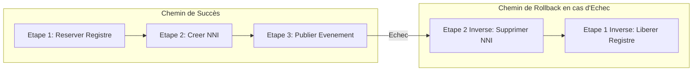

# VOLUME 3 : Ingénierie des Workflows (Engineering Standards)
## Usine Nationale des Workflows — SNISID

L'implémentation logicielle des workflows BPMN dans le moteur d'orchestration (ex: Temporal.io / Camunda) doit respecter des standards d'ingénierie stricts, garantissant que le système se comporte comme une infrastructure critique, résiliente et inaltérable.

---

## ⏱️ CHAPITRE 1 : SLA, SLO ET GESTION DU TEMPS

### 1.1 Accords de Niveau de Service (SLA) & Timers
Les processus de l'État Civil ont des contraintes légales de temps. Le moteur de workflow doit surveiller les délais d'exécution.
*   **Timer Automatique:** Si une validation humaine n'est pas effectuée dans le SLA défini (ex: 72h pour un juge de paix), le workflow émet automatiquement un événement d'escalade hiérarchique vers Kafka `tg.workflow.escalation.alerts`.
*   **Objectifs de Niveau de Service (SLO):** Latence P99 pour la création d'un événement d'enrôlement < 500ms. Temps d'acquittement Kafka < 50ms.

---

## 🔄 CHAPITRE 2 : RÉSILIENCE, RETRIES ET ROLLBACKS (SAGAS)

Les architectures distribuées défaillent. Le SNISID n'utilise pas de Two-Phase Commit bloquant, mais des Sagas avec actions compensatoires.

### 2.1 Pattern Saga et Compensations (Rollback)
Lorsqu'un workflow traverse plusieurs domaines (ex: ANH pour l'acte, ONI pour l'identité, DGI pour les impôts), chaque étape doit posséder sa fonction inverse.

### 2.2 Stratégies de Retries et Backoff Exponentiel
*   **Politique Standard:** Pour toute erreur réseau transitoire (`503 Service Unavailable`, `Timeout`), le moteur exécute un *Exponential Backoff* (Délai initial: 5s, Multiplicateur: 2.0, Délai maximum: 1 heure, Tentatives illimitées ou limitées à 30 jours selon le workflow).
*   **Dead Letter Queue (DLQ):** Les erreurs non-transitoires (`400 Bad Request`, échec de validation de signature PKI) sont immédiatement déroutées vers la DLQ pour investigation manuelle du SOC.

---

## 🔐 CHAPITRE 3 : SIGNATURES PKI ET VALIDATION HUMAINE

### 3.1 Validation par Signature Numérique (FIDO2 / eID)
Aucune transition d'état critique (approbation de naissance, divorce, révocation) ne s'effectue sans signature cryptographique.
1.  **L'Agent / Juge** insère sa Smart Card (eID) ou touche sa clé YubiKey FIDO2.
2.  **Payload Signée:** Le Hash SHA-256 des données du formulaire est signé par la clé privée de l'agent.
3.  **Vérification PKI (Worker Node):** Le moteur BPMN appelle l'AN-PKI via OCSP pour s'assurer que le certificat de l'agent n'est pas révoqué (Status: GOOD) et que la signature est mathématiquement valide.

---

## 🛡️ CHAPITRE 4 : AUDIT IMMUTABLE (WORM LOGGING) ET ÉVÉNEMENTS (EVENT SOURCING)

### 4.1 Event Sourcing
La base de données relationnelle ne stocke que l'état *actuel*. L'historique complet est généré par l'Event Sourcing. Chaque changement d'état du BPMN émet un événement.

### 4.2 Immutable Logging (WORM - Write Once Read Many)
Les journaux d'audit de l'exécution des workflows sont stockés dans un stockage WORM compatible S3 (ex: MinIO avec Object Lock Compliance Mode). Il est technologiquement impossible, même pour l'administrateur de base de données root, de supprimer ou modifier un enregistrement d'état civil passé sans corrompre le hash de la blockchain de l'État.

---

## 🧮 CHAPITRE 5 : CALCUL DU SCORE DE FRAUDE (FRAUD SCORING)

Chaque transaction exécute une fonction d'évaluation des risques en arrière-plan.

### L'Équation du SNISID Risk Score

$$\text{Fraud\_Score} = (W_{bio} \times C_{abis}) + (W_{vel} \times C_{freq}) + (W_{geo} \times C_{ip}) + (W_{cert} \times C_{trust})$$

*   **$C_{abis}$ (Conflit Biométrique) :** Pondération très élevée. Si l'ABIS retourne un conflit (Score > 85%), le score de fraude bondit de +60 points.
*   **$C_{freq}$ (Vélocité) :** Si un agent approuve plus de 40 actes de mariage en 1 heure (impossible humainement), le score bondit de +50 points.
*   **Action du Moteur:** 
    *   Score < 30 : Transaction Autorisée.
    *   Score 30-70 : Transaction Suspendue pour Adjudication Humaine.
    *   Score > 70 : Alerte SOC/DCPJ, Transaction Bloquée.
