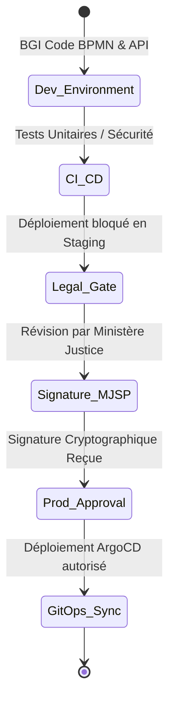

# VOLUME 5 : Gouvernance et Cycle de Vie (Workflow Governance)
## Usine Nationale des Workflows — SNISID

L'Usine Nationale des Workflows n'est pas un système statique. Elle évolue avec les décrets gouvernementaux. Ce document définit les politiques de modification, de versionnage et d'escalade d'urgence de la plateforme.

---

## 🏛️ CHAPITRE 1 : PROPRIÉTÉ ET GOUVERNANCE (OWNERSHIP)

### 1.1 Séparation des Pouvoirs Numériques
*   **Bureau de Gouvernance des Workflows (BGW) :** Propriétaire fonctionnel et légal. Composé de juristes de l'ANI, de l'ANH et du MJSP. Ils modélisent le BPMN.
*   **Bureau de Gouvernance de l'Interopérabilité (BGI) :** Propriétaire technique. Composé des SRE et développeurs de l'Agence Nationale de Cybersécurité (ANCD). Ils implémentent les API et les Sagas.

### 1.2 Workflow d'Approbation et de Validation Légale
Aucun changement sur un BPMN critique (ex: ajout d'une condition au mariage) ne peut aller en production sans une Chaîne de Validation Légale.

*(Le pipeline d'Intégration Continue GitOps vérifie l'existence de la signature électronique du directeur juridique avant d'autoriser la fusion du code sur la branche `main` de production).*

---

## 🚀 CHAPITRE 2 : VERSIONNAGE ET DÉPLOIEMENT (VERSIONING)

Les workflows sont versionnés sémantiquement (SemVer vX.Y.Z). Le système gère les processus d'état civil qui peuvent durer plusieurs mois (ex: enquête d'adoption).

### 2.1 Stratégie Blue-Green Process Migration
*   **Version Mineure (Patch):** Les instances de workflows actives sont migrées dynamiquement vers la nouvelle définition si cela ne casse pas l'état.
*   **Version Majeure (Breaking Change):** Les transactions en cours continuent de s'exécuter sur le moteur BPMN $V1$. Les nouvelles requêtes de guichet sont routées vers le moteur BPMN $V2$. La $V1$ est mise au statut `Deprecated` et sera détruite automatiquement quand plus aucune transaction n'y sera active.

---

## 🚨 CHAPITRE 3 : MATRICE D'ESCALADE ET GOUVERNANCE OPÉRATIONNELLE

Les exploitants H24 (SOC / NOC) doivent utiliser cette matrice de décision en cas de crise majeure sur le système.

| Incident | Détection | Impact | Action d'Urgence Autorisée | Niveau Décision |
| :--- | :--- | :--- | :--- | :--- |
| **Piratage ABIS** | Hit ABIS Falsifiés massifs | Usurpation massive identité | Couper physiquement connexion ABIS central | **NOC Commander** |
| **Crash Kafka Central** | Latence publication > 30s | Paralysie Guichets | Bascule (Failover) sur le Datacenter Cap-Haïtien | **SRE Lead** |
| **Corruption Audit Log** | WORM Hash Chain brisée | Falsification de l'État Civil | Geler l'intégralité du Registre (Read-Only) | **CISO National + MJSP** |
| **DDoS sur API X-Road** | Déni de service | Impossibilité de valider NNI | Activer Cache Statistique & Couper requêtes Internationales | **SOC L3** |

---

## 📌 CHAPITRE 4 : GESTION DU CYCLE DE VIE DES DONNÉES

### Politique de Rétention Légalement Définie
*   **Événements WORM Kafka :** Rétention Infini (Conservation Perpétuelle).
*   **Vidéos / Captures Biomètriques des Adjudications :** Conservées 10 ans dans un Bucket S3 froid (Glacier) post-résolution, puis destruction sécurisée avec attestation cryptographique.
*   **Logs d'Accès Agents (Zero Trust) :** Conservés 5 ans pour enquêtes de l'Inspection Générale (DCPJ).
